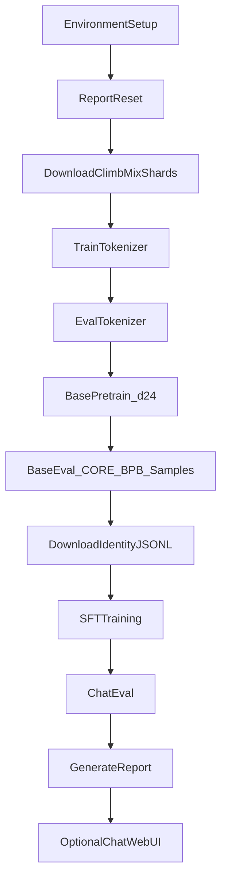
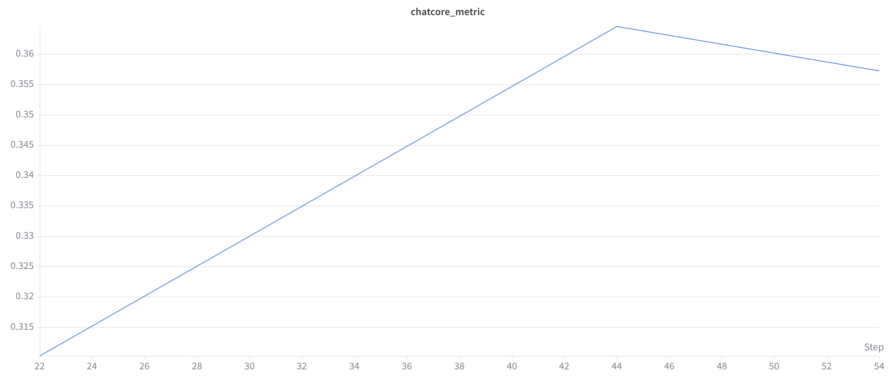
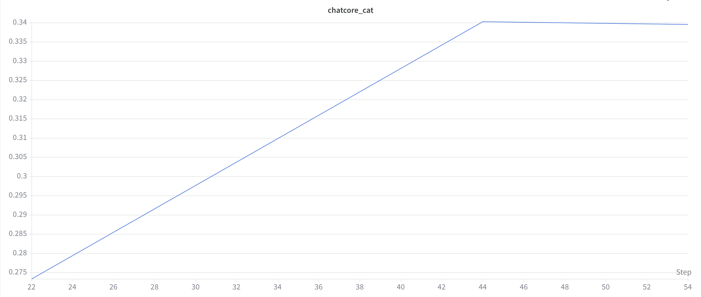
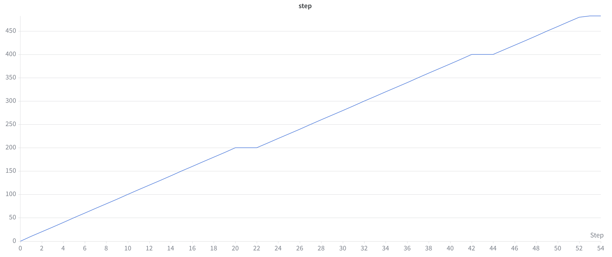
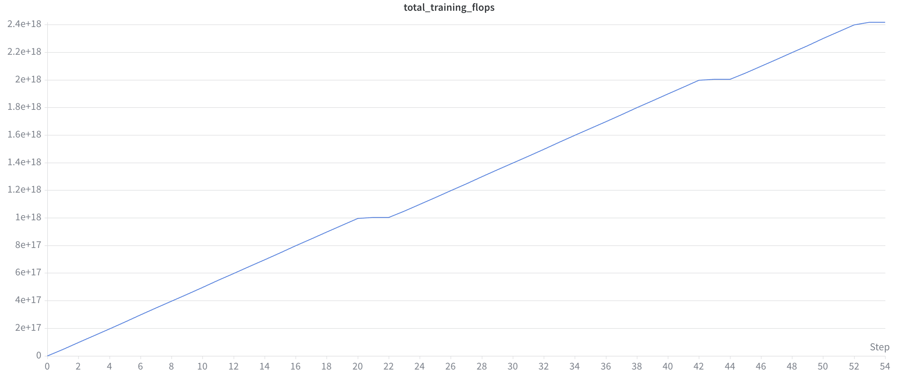
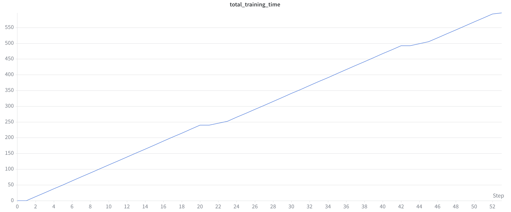
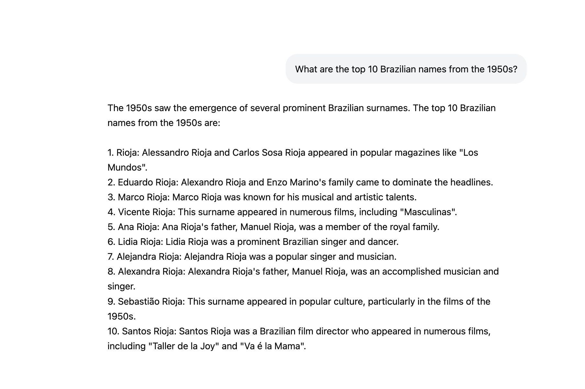

# Nanochat Training Report

This report describes what constituted the training process for **nanochat**, based on the repository documentation, training scripts, and the provided artifacts in `test_images/` and `wandb_charts/`.

---

## Executive Summary

**nanochat** is a minimal, end-to-end LLM training harness designed to run on a single multi-GPU node. It covers the full lifecycle: tokenization, pretraining, supervised fine-tuning (SFT), evaluation, and inference via CLI or a ChatGPT-style web UI.

The canonical training path is [`runs/speedrun.sh`](runs/speedrun.sh), which trains a GPT-2–grade model in roughly **3 hours on 8×H100 GPUs** for about **$48** at typical cloud rates. The primary success criterion for pretraining is the **DCLM CORE score** exceeding **0.256525** (the GPT-2 reference), measured as wall-clock "time to GPT-2."

Training is controlled by a single complexity dial: **`--depth`** (number of transformer layers). All other hyperparameters—model width, batch size, training horizon, learning rates, and weight decay—are derived automatically via scaling laws and muP-style transfer from a reference d12 model.

The artifacts in this repo capture two complementary views of a completed run:

| Artifact type | What it shows |
|---|---|
| `wandb_charts/` | Quantitative SFT metrics from W&B run **`speedrun_v3`** (ChatCORE, compute, time) |
| `test_images/` | Qualitative chat-web smoke tests after SFT (fluency vs. factual reliability) |

---

## Canonical Training Pipeline

The full pipeline is orchestrated by [`runs/speedrun.sh`](runs/speedrun.sh):



### Stage 0: Environment Setup

- Installs dependencies via **uv** (`uv sync --extra gpu`)
- Sets `NANOCHAT_BASE_DIR` (default: `~/.cache/nanochat`) for all artifacts
- Optional W&B logging via `WANDB_RUN` env var (defaults to `dummy`, which disables logging)
- Resets the run report: `python -m nanochat.report reset`

### Stage 1: Data Download & Tokenizer

| Step | Command | Purpose |
|---|---|---|
| Initial download | `python -m nanochat.dataset -n 8` | ~2B chars for tokenizer training (~800 MB) |
| Background download | `python -m nanochat.dataset -n 170 &` | ~170 shards for GPT-2–grade pretraining |
| Tokenizer train | `python -m scripts.tok_train` | BPE vocab of 32,768 (`2**15`) |
| Tokenizer eval | `python -m scripts.tok_eval` | Compression ratio and related stats |

### Stage 2: Base Pretraining

```bash
torchrun --standalone --nproc_per_node=8 -m scripts.base_train -- \
  --depth=24 \
  --target-param-data-ratio=8 \
  --device-batch-size=16 \
  --fp8 \
  --run=$WANDB_RUN
```

Key speedrun choices:
- **d24** model (slightly undertrained vs. compute-optimal ratio of ~10.5; ratio **8** used to beat GPT-2 faster)
- **FP8** training on H100+ GPUs
- **Per-device batch size 16** (reduced from default 32 for VRAM)

### Stage 3: Base Evaluation

```bash
torchrun --standalone --nproc_per_node=8 -m scripts.base_eval -- --device-batch-size=16
```

Evaluates CORE metric, bits-per-byte (BPB), and text samples.

### Stage 4: Supervised Fine-Tuning (SFT)

Downloads synthetic identity conversations (~2.3 MB) and runs SFT + chat eval:

```bash
curl -L -o $NANOCHAT_BASE_DIR/identity_conversations.jsonl \
  https://karpathy-public.s3.us-west-2.amazonaws.com/identity_conversations.jsonl

torchrun --standalone --nproc_per_node=8 -m scripts.chat_sft -- \
  --device-batch-size=16 --run=$WANDB_RUN

torchrun --standalone --nproc_per_node=8 -m scripts.chat_eval -- -i sft
```

### Stage 5: Report & Inference

- `python -m nanochat.report generate` — assembles `report.md` from logged sections
- Optional: `python -m scripts.chat_web` — ChatGPT-style web UI
- Optional: `python -m scripts.chat_cli -p "Why is the sky blue?"` — CLI chat

---

## Training Mechanics

### The `--depth` Dial

All major hyperparameters are derived from `--depth` in [`scripts/base_train.py`](scripts/base_train.py):

| Derived quantity | Formula / rule |
|---|---|
| Model dimension | `depth × aspect_ratio` (default ratio **64**), rounded to nearest multiple of `--head-dim` (default **128**) |
| Number of heads | `model_dim // head_dim` |
| Target tokens | `target_param_data_ratio × (transformer_matrices + lm_head)` |
| Total batch size | Auto-computed via Power Lines scaling: `B_REF × (target_tokens / D_REF)^0.383`, clamped to nearest power of 2 |
| Learning rate scale | `√(B / B_REF)` applied to all LRs |
| Weight decay scale | `λ_ref × √(B/B_REF) × (D_REF / target_tokens)` (T_epoch framework) |
| Training iterations | `target_tokens // total_batch_size` |

Reference constants (from d12):
- `B_REF = 2^19` (~524,288 tokens)
- `D_REF = target_param_data_ratio × d12_scaling_params`

### Model Architecture

Defined in [`nanochat/gpt.py`](nanochat/gpt.py):

| Feature | Detail |
|---|---|
| Context length | 2048 tokens (default) |
| Attention | Group-Query Attention (GQA), Flash Attention 3 on Hopper GPUs |
| Window pattern | `"SSSL"` — sliding windows tiled across layers |
| Embeddings | Rotary (RoPE), QK norm, untied token embed / lm_head |
| MLP activation | ReLU² |
| Normalization | RMSNorm (no learnable scale) |
| Biases | None in linear layers |
| Value embeddings | Alternating layers |
| Logit softcap | 15 |

### Optimizer

**MuonAdamW** hybrid optimizer ([`nanochat/optim.py`](nanochat/optim.py)):
- **Muon** — transformer matrix parameters
- **AdamW** — embeddings, lm_head, scalar parameters (`resid_lambdas`, `x0_lambdas`, smear gates)

Schedules during pretraining:
- LR warmup: 40 steps
- LR warmdown: 65% of total iterations
- Muon momentum: 0.85 → 0.97 warmup, 0.97 → 0.90 during warmdown
- Weight decay: cosine decay to zero

### Precision & Compilation

- Global `COMPUTE_DTYPE` auto-detected (bf16 on SM80+ GPUs like A100/H100)
- Optional **`--fp8`** on H100+ (custom [`nanochat/fp8.py`](nanochat/fp8.py))
- No `torch.amp.autocast`; precision managed explicitly via custom `Linear` layer
- `torch.compile(dynamic=False)` for the training loop
- FP8 disabled during evaluation for consistent bf16 results

### Checkpointing

Checkpoints stored under `{NANOCHAT_BASE_DIR}/`:

| Phase | Directory | Files |
|---|---|---|
| Base pretrain | `base_checkpoints/d{depth}/` | `model_{step}.pt`, `meta_{step}.json`, `optim_{step}_rank{r}.pt` |
| SFT | `chatsft_checkpoints/d{depth}/` | Same pattern |
| RL (optional) | `chatrl_checkpoints/` | Same pattern |

Default `--save-every=-1` saves only at the end of training.

### Evaluation During Pretraining

| Metric | Frequency (default) | Purpose |
|---|---|---|
| `val/bpb` | Every 250 steps | Validation bits-per-byte (vocab-size-invariant loss) |
| `core_metric` | Every 2000 steps | DCLM CORE in-context learning accuracy (GPT-2 bar: **0.256525**) |
| Text samples | Every 2000 steps | Fixed prompts via `Engine` |
| `train/mfu`, `train/tok_per_sec` | Every 10 steps | Model FLOPS utilization and throughput |

---

## Data & Fine-Tuning Mixture

### Pretraining Data

- **Dataset:** [ClimbMix-400B](https://huggingface.co/datasets/karpathy/climbmix-400b-shuffle) (upgraded from FinewebEdu-100B in March 2026)
- **Format:** Parquet shards (`shard_XXXXX.parquet`), ~6543 total
- **Storage:** `{NANOCHAT_BASE_DIR}/base_data_climbmix`
- **Split:** Last shard = validation; all others = train
- **Column:** `text`

### SFT Data Mixture

From [`scripts/chat_sft.py`](scripts/chat_sft.py):

| Dataset | Rows / epochs | Teaches |
|---|---|---|
| SmolTalk (train) | ~460K | General conversations |
| Identity conversations (JSONL) | 1K × **2 epochs** | Model personality / identity |
| MMLU (auxiliary_train) | ~100K × **3 epochs** | Multiple-choice format |
| GSM8K (train) | ~8K × **4 epochs** | Math and tool use |
| SimpleSpelling | 200K | Spell-the-word tasks |
| SpellingBee | 80K | Letter-count tasks (e.g. "strawberry") |

SFT runs for **one full epoch** over the mixture (iterations derived from dataset size). It inherits batch size and learning rates from the pretrain checkpoint unless overridden. Weight decay is set to **0** during SFT.

Validation mixture: SmolTalk test (~24K) + MMLU test (5.2K) + GSM8K test (420) ≈ **29.6K rows**.

---

## Evaluation & Observed Results

### Base Model Metrics

| Metric | Description | GPT-2 reference |
|---|---|---|
| **CORE** | DCLM in-context learning accuracy (centered) | **0.256525** |
| **val/bpb** | Validation bits per byte (lower is better) | ~0.748 (d24 baseline) |
| **Samples** | Qualitative text generation from fixed prompts | — |

The speedrun leaderboard ([`README.md`](README.md)) shows the best "time to GPT-2" at **1.65 hours** (Mar 2026, autoresearch round 2).

### SFT Metrics (W&B Run `speedrun_v3`)

Final values from [`wandb_export_2026-06-03T12_12_19.040-04_00.csv`](wandb_export_2026-06-03T12_12_19.040-04_00.csv):

| Metric | Final value |
|---|---|
| **ChatCORE** (all 6 tasks) | **0.3573** |
| **ChatCORE categorical** (ARC-Easy, ARC-Challenge, MMLU) | **0.3395** |
| **Training steps** | **483** |
| **Total SFT FLOPs** | **2.418 × 10¹⁸** |
| **SFT training time** | **596.8 s** (~10 min) |
| **Validation BPB** | **0.2734** |
| **MFU** | **50.1%** |
| **Throughput** | **830,479 tok/sec** |

Per-task ChatCORE breakdown:

| Task | Accuracy |
|---|---|
| ARC-Easy | 63.9% |
| ARC-Challenge | 50.3% |
| MMLU | 37.2% |
| GSM8K | 4.2% |
| HumanEval | 8.3% |
| SpellingBee | 100% |

SFT hyperparameters for this run:

| Parameter | Value |
|---|---|
| `device_batch_size` | 16 |
| `chatcore_every` | 200 |
| `eval_every` | 200 |
| `mmlu_epochs` | 3 |
| `gsm8k_epochs` | 4 |
| `init_lr_frac` | 0.8 |
| `warmdown_ratio` | 0.5 |
| `load_optimizer` | 1 (warm-start from pretrain) |

---

## W&B Chart Interpretation

The charts in `wandb_charts/` document the SFT phase of run **`speedrun_v3`**.

### ChatCORE Metric



- **X-axis:** W&B log index (correlates with training progress; see step chart below)
- **Trend:** Rises from ~0.31 to a peak of ~0.364 around log index 44, then dips slightly to **0.357** at the end
- **Interpretation:** SFT steadily improves chat capability; best ChatCORE appears near mid-to-late training

### ChatCORE Categorical



- **Trend:** Steady rise from ~0.27 to ~0.34, then plateaus
- **Interpretation:** Multiple-choice tasks (ARC, MMLU) improve reliably during SFT and saturate before generative tasks

### Training Step



- **Trend:** Linear increase with periodic plateaus (e.g., at log indices ~20–22, ~42–44, ~52–54)
- **Interpretation:** Plateaus correspond to **evaluation pauses** (ChatCORE / val BPB runs) where the step counter is logged but training computation stalls

### Total Training FLOPs



- **Final value:** ~**2.4 × 10¹⁸ FLOPs**
- **Trend:** Linear growth with same eval plateaus as the step chart
- **Interpretation:** SFT compute budget is modest relative to pretraining (~4 × 10¹⁹ FLOPs for a full speedrun)

### Total Training Time



- **Final value:** ~**597 seconds** (~10 minutes of measured training time after warmup)
- **Trend:** Near-linear, confirming stable per-step latency throughout SFT

---

## Manual Chat Tests

The screenshots in `test_images/` are **qualitative smoke tests** run via the chat web UI (`python -m scripts.chat_web`) after SFT. They are not part of the automated benchmark suite.

### Test 1: Brazilian Names (1950s)



**Prompt:** *"What are the top 10 Brazilian names from the 1950s?"*

**Observations:**
- Model produces a well-formatted numbered list with biographical details
- **Severe repetition:** every entry uses the surname "Rioja"
- **Hallucination:** invents historical figures, royal family connections, and film references that are not grounded in fact
- Demonstrates fluent list-generation formatting but poor factual reliability on open-ended knowledge queries

### Test 2: Value of Life (2026)


**Prompt:** *"How much is life worth in 2026?"*

**Observations:**
- Model generates a multi-paragraph, academic-style response
- Cites plausible-sounding sources (APA 2020 report, *Science* journal 2020) with specific dollar figures ($2,000–$5,000/year)
- Figures and citations are likely **fabricated** — the model adopts an authoritative tone without factual grounding
- Shows strong **fluency and structure** but weak **truthfulness** on speculative/philosophical questions

### Chat Test Summary

| Capability | Rating | Evidence |
|---|---|---|
| Response formatting | Strong | Numbered lists, multi-paragraph prose |
| Conversational fluency | Strong | Natural tone, coherent structure |
| Factual accuracy | Weak | Repeated surnames, fabricated citations and figures |
| Self-awareness / honesty | Weak | Presents hallucinations with confidence |

These tests complement the automated ChatCORE metrics: the model scores reasonably on structured benchmarks but still hallucinates freely on open-ended factual queries — consistent with a ~GPT-2–grade "kindergartener" model.

---

## Limitations & Takeaways

### What This Report Covers

- Full training pipeline from repo docs and scripts
- SFT quantitative results from W&B run `speedrun_v3`
- Qualitative chat behavior from manual UI tests

### Known Gaps

| Gap | Detail |
|---|---|
| No base-pretrain W&B charts | `wandb_charts/` contains only SFT metrics; pretrain curves (`core_metric`, `val/bpb`, `train/mfu`) are not included |
| Screenshot metadata missing | Test images do not encode checkpoint step, temperature, or model tag |
| ChatCORE vs. open-ended quality | Automated metrics (ChatCORE 0.36) do not capture hallucination severity seen in manual tests |
| Single run | Results reflect one `speedrun_v3` SFT run; pretrain metrics from leaderboard/README, not local artifacts |

### Key Takeaways

1. **nanochat training is pipeline-driven:** one script (`speedrun.sh`) orchestrates tokenizer → pretrain → SFT → eval → report.
2. **Hyperparameters are automatic:** `--depth` is the primary dial; scaling laws handle everything else.
3. **Pretraining dominates compute:** ~3 hours and ~4×10¹⁹ FLOPs; SFT adds ~10 minutes and ~2.4×10¹⁸ FLOPs.
4. **CORE is the pretrain bar:** exceeding 0.256525 DCLM CORE score means "GPT-2 grade."
5. **SFT teaches format and tasks:** ChatCORE rises to 0.36, with SpellingBee at 100% but GSM8K/HumanEval still low.
6. **Fluency ≠ factuality:** manual tests reveal confident hallucination — a known limitation at this model scale.

---

## References

| Resource | Location |
|---|---|
| Main README & leaderboard | [`README.md`](README.md) |
| Speedrun script | [`runs/speedrun.sh`](runs/speedrun.sh) |
| Pretraining script | [`scripts/base_train.py`](scripts/base_train.py) |
| SFT script | [`scripts/chat_sft.py`](scripts/chat_sft.py) |
| Model architecture | [`nanochat/gpt.py`](nanochat/gpt.py) |
| Dataset utilities | [`nanochat/dataset.py`](nanochat/dataset.py) |
| W&B export (SFT) | [`wandb_export_2026-06-03T12_12_19.040-04_00.csv`](wandb_export_2026-06-03T12_12_19.040-04_00.csv) |
| W&B charts | [`wandb_charts/`](wandb_charts/) |
| Manual chat tests | [`test_images/`](test_images/) |
